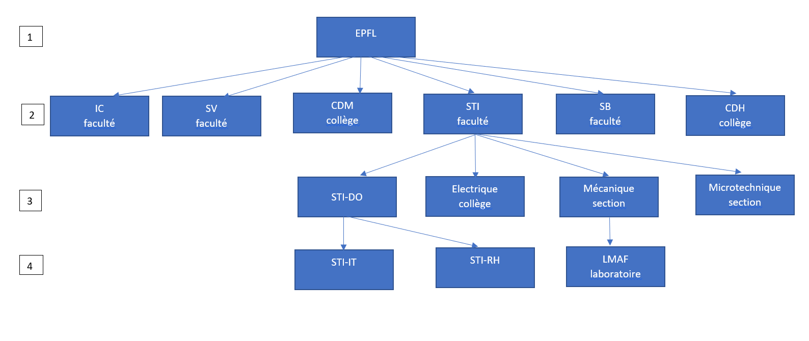

#Introduction  
L'EPFL est une des deux écoles polytechniques fédérales suisses. C'est une des institutions de science et de technologie les plus dynamiques et cosmopolites d'Europe.  
##Histoire de l'EPFL  
- 1853 : Création de L'Ecole spéciale de Lausanne.  
- 1944 : L'école devient l'Ecole polytechnique de l'Université de Lausanne.   
- 1969 : l'EPFL est officiellement fondée le 1er janvier.  
#Structure EPFL  
##Facultés et Collèges  
Le campus est composé de 5 facultés et de 3 collèges :  
- Faculté de l'environment naturel, architectural et construit, **ENAC**  
- Faculté Informatique et Communications, **IC**  
- Faculté Sciences de Base, **SB**  
- Faculté des Sciences et des Techniques de L'Ingénieur, **STI**  
- Faculté des Sciences de la Vie, **SV**  
- Collège des Humanités, **CDH**  
- Collège du Management, **CDM**  
- Middle- East  
#Acréditations  
L'EPFL est une organisation qui est divisée en 5 facultés et en 3 collèges (cf Facultés et Collèges). Chaque faculté est-elle même divisée en sections et en unités administratives.     

Dans le schéma ci-dessus, Chaque rectangle est appelé une unité. Une unité peut être une faculté, un laboratoire, un service IT d'une faculté, etc. Celles-ci ont un niveau correspondant à leur position dans la hiérarchie. Les niveaux vont de 1 à 4 comme dans l'exemple ci-dessus, 1 étant le plus élevé et 4 le moins élevé.  
Toutes les personnes appartiennent à une unité de niveau 4. Cette relation entre une personne et une unité est appelée **accréditation**.  
Chaque personne, représentée par son numéro sciper, a une ou plusieurs accréditations dans différentes unités et toutes ces accréditations sont identifiables par un ID unique.  
Les accréditations conférent un **rôle** a chaque personne qui peut être par exemple:  
- Responsable communication  
- Responsable IT  
- Administrateur inventaire  
<!-- commentaire pour faire un espace-->  
Chaque rôle permet d'obtenir un ensemble de droits. Ces droits peuvent être par exemple :     
- Editer WordPress  
- Envoyer des Mass Mail 
- Dépenser 5'000 Francs  
Ces droits peuvent être exercés sur l'unité de correspondant à l'accréditation et sur toutes les unités qui en découlent. Par exemple dans la première figure, si on a un droit sur l'unité STI, on l'a également sur toutes les sections qui appartiennent a STI, sur tous les labos de STI, etc. On dit que les droits sont héréditaires. Les droits conférés par les rôles sont appelés droits implicites.   
D'autre part, il y a les droits explicites. Ce sont des droits qu'une personne 1, qui les a, donne à une personne 2 qui ne les a pas. La personne 2 a donc de nouveaux droits qui s'appliquent seulement aux unités où la personne 1 avait ce droit. Par exemple si quelqu'un à un droit particulier sur l'unité STI, et donc sur toutes les unités qui en découlent, et donne ce droit à une personne en d'un laboratoire de IC, alors cette personne aura un nouveau droit sur toute la section STI.  

#Information Pratique  
##Camipro  
La carte camipro est en quelque sorte la carte d'identité de l'EPFL. Elle permet de :  
- Payer de la nourriture dans les restaurants de l'EPFL (et d'obtenir des rabais), dans les distributeurs, et des cafés dans les machines.  
- Imprimer des documents dans les imprimantes de l'EPFL.  
- Avoir des rabais dans certains commerces hors de l'EPFL (voici la liste des partenaires <https://camipro.epfl.ch/fr/autres_fonctions/avantages/>)  
- Accédér à certaines zones de l'EPFL si vous êtes autorisés.  
- Emprunter un vélo publibike (cf Transport).  
<!-- commentaire pour faire un espace--> 
Vous pouvez recharger votre camipro à l'AGEPOLY à l'esplanade avec de l'argent liquide ou par carte de crédit dans les bornes de recharge.  
En cas de vol vous pouvez bloquer votre camipro via l'application (cf application) et en racheter une nouvelle au guichet des Services Aux Etudiants qui se trouve dans le batiment BP.    
##Transport  
L'EPFL est relié à :  
- Lausanne-Flon grâce au métro M1 direction Lausanne-Flon.  
- La gare de Lausanne depuis Lausanne-Flon grâce au métro M2 direction Ouchy-Olympique.    
- La gare de Rennens via le métro M1 direction Rennens.  
Les horaires sont disponibles sur <https://www.t-l.ch/>  
<!-- commentaire pour faire un espace-->  
Pour aller à l'aéroport de Genève, il faut prendre le train depuis Lausanne-Gare ou depuis Rennens-Gare. Plus de détails sont disponibles sur <https://www.sbb.ch/fr/>  
<!-- commentaire pour faire un espace-->  
Vous pouvez également vous déplacer a vélo grâce à l'application publibike en vous inscrivant avec votre mail de l'EPFL, ce qui vous donnera à chaque trajet de vélo 1h gratuite. Voici le lien pour s'inscrire <https://www.publibike.ch/fr/publibike/>.  
<!-- commentaire pour faire un espace-->  
Enfin vous pouvez bénéficier d'un parking à un prix avantageux si vous êtes collaborateur à l'EPFL depuis l'application pocket campus (cf Application) dans l'onglet parking.  
##Application  
L'application officielle de l'EPFL est pocket campus qui est disponible sur toutes IOS, Android et Windows. Elle permet de :
- Se reperer à l'EPFL grâce a un plan.  
- Avoir les horaires du metro M1.  
- Voir son solde camipro et envoyer de l'argent depuis sa camipro à d'autres gens.  
- Imprimer sur une imprimante de l'EPFL.  
- Réserver un parking place verte.  
- Rechercher des collaborateurs de l'EPFL sur l'annuaire.  
##Centre de langue  
Le centre de langues permet de faire des cours de langues gratuitement. Il se situe au batiment CM. Vous pouvez vous inscire depuis la page <https://www.epfl.ch/campus/services/internal-trainings/language-centre/>.  
##Plus d'informations  
Vous pouvez trouver plus d'informations sur le site <https://www.epfl.ch/campus/services/accueil/ressources-humaines/nouveaux-collaborateurs-trices/>

