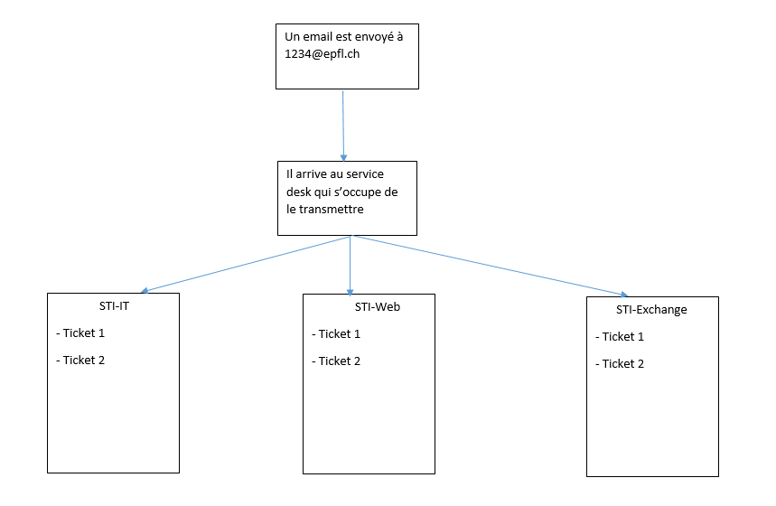
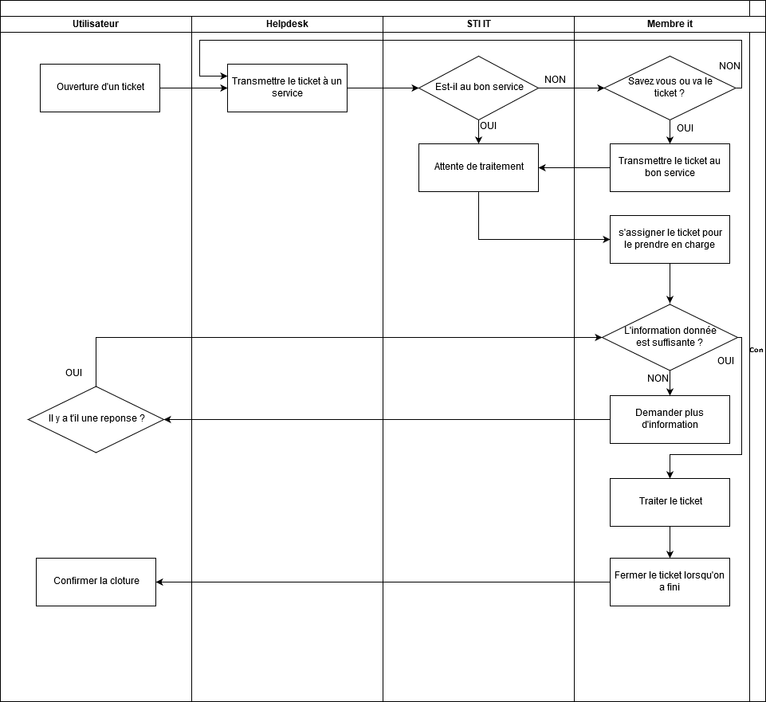

#Introduction  
L'EPFL est une des deux écoles polytechniques fédérales suisses. C'est une des institutions de science et de technologie les plus dynamiques et cosmopolites d'Europe.  
##Histoire de l'EPFL  
- 1853 : Création de L'Ecole spéciale de Lausanne.  
- 1944 : L'école devient l'Ecole polytechnique de l'Université de Lausanne.   
- 1969 : l'EPFL est officiellement fondée le 1er janvier.  
#Structure EPFL  
##Facultés et Collèges  
Le campus est composé de 5 facultés et de 3 collèges :  
- Faculté de l'environment naturel, architectural et construit, **ENAC**  
- Faculté Informatique et Communications, **IC**  
- Faculté Sciences de Base, **SB**  
- Faculté des Sciences et des Techniques de L'Ingénieur, **STI**  
- Faculté des Sciences de la Vie, **SV**  
- Collège des Humanités, **CDH**  
- Collège du Management, **CDM**  
- Middle- East  
#Accréditations  
L'EPFL est une organisation qui est divisée en 5 facultés et en 3 collèges (cf Facultés et Collèges). Chaque faculté est composée de sections et d'unités administratives.     

Dans le schéma ci-dessus, Chaque rectangle est appelé une unité. Une unité peut être une faculté, un laboratoire, le service IT d'une faculté, etc. Celles-ci ont un niveau correspondant à leur position dans la hiérarchie. Les niveaux vont de 1 à 4 (1 le plus élevé et 4 le moins élevé)..  
Toutes les personnes appartiennent à une unité de niveau 4. Cette relation entre une personne et une unité est appelée **accréditation**.  
Chaque personne, représentée par son numéro sciper, a une ou plusieurs accréditations dans différentes unités et chaque accréditation est identifiables par un ID unique.  
Les accréditations conférent un **rôle** a chaque personne qui peut être par exemple:  
- Responsable communication  
- Responsable IT  
- Administrateur inventaire  
<!-- commentaire pour faire un espace-->  
Chaque rôle permet d'obtenir un ensemble de droits. Ces droits peuvent être par exemple :     
- Editer WordPress  
- Envoyer des Mass Mail 
- Dépenser 5'000 Francs  
<!-- commentaire pour faire un espace-->  
Ces droits peuvent être exercés sur l'unité de correspondant à l'accréditation et sur toutes les unités qui en découlent. Par exemple dans la première figure, si on a un droit sur l'unité STI, on l'a également sur toutes les sections qui appartiennent a STI, sur tous les labos de STI, etc. On dit que les droits sont héréditaires. Les droits conférés par les rôles sont appelés droits implicites.   
D'autre part, il y a les droits explicites. Ce sont les droits qu'une personne A peut donner à une autre personne B. A doit avoir les droits pour les donner à B et  ces droits s'appliquent seulement aux unités où A a les droits. Par exemple si quelqu'un à un droit particulier sur l'unité STI, et donc sur toutes les unités qui en découlent, et donne ce droit à une personne en d'un laboratoire de IC, alors cette personne aura un nouveau droit sur toute la section STI.  
<!-- commentaire pour faire un espace-->  
Vous pouvez trouver plus d'informations concernant les accréditations sur <https://accreditation.epfl.ch/comprendre/>

#Service Desk  
L'epfl est composé d'un service desk qui s'occupe de traiter tous les problèmes IT et questions qu'ont les collaborateurs de l'EPFL. Les demandes faites par les collaborateurs sont appelés tickets. Ces tickets sont redirigés par le service desk vers l'unité de l'epfl qui doit le traiter. Ainsi le travail du service desk est principalement de transmettre les tickets vers le bon service.  
Les personnes chargées de régler les problèmes des collaborateurs sont divisés en unités et chaque unité reçoit les requêtes lui correspondantes. Une personne peut faire partie de plusieurs unités. Dès qu'une personne décide de traiter un ticket, elle se l'assigne et le ticket ne peut plus être traité par une autre personne. Ceci permet de ne pas traiter un même ticket plusieurs fois.  

D'autre part, lorsqu'on fait la description du problème dans le ticket, il est préférable de suive une forme précise qui est la suivante :  
- Description du problème  
- Etapes de reproduction, ie Les étapes réalisées avant d'avoir le problème    
- Comportement constaté, ie qu'est ce qui s'est passé  
- Comportement attendu, ie ce que le collaborateur voulait qu'il se passe  
A partir de ces informations, il est généralement possible de résoudre un ticket. Cependant si l'information est insuffisante pour résoudre le problème, alors il est possible grâce à la boite de dialogue de demander des informations supplémentaires.  
Si le collaborateur de répond pas après plusieurs rappels, il est possible de classer le ticket comme résolu avec comme code de fermeture Pas de réponse.  
De plus si vous ne savez pas résoudre le ticket mais vous savez qui peut le résoudre, vous pouvez le lui transmettre ou le lui assigner.  
Lorsque le ticket est résolu, son statut doit être changé à résolu.  
<!-- commentaire pour faire un espace--> 
Voici le processus de création et de résolution de ticket illustré par un schéma:  
  
###Questions  
- Si la personne qui à ouvert le ticket ne répond pas à vos demandes pour plus d'information, vous pouvez fermer le ticket  
#Information Pratique  
##Camipro  
La carte camipro est en quelque sorte la carte d'identité de l'EPFL. Elle permet de :  
- Payer de la nourriture dans les restaurants de l'EPFL (et d'obtenir des rabais), dans les distributeurs, et des cafés dans les machines.  
- Imprimer des documents dans les imprimantes de l'EPFL.  
- Avoir des rabais dans certains commerces hors de l'EPFL (voici la liste des partenaires <https://camipro.epfl.ch/fr/autres_fonctions/avantages/>)  
- Accédér à certaines zones de l'EPFL si vous êtes autorisés.  
- Emprunter un vélo publibike (cf Transport).  
- Utiliser un grill éléctrique en le réservant au préalable sur <https://camipro.epfl.ch/fr/autres_fonctions/polygrill/>.  
- Obtenir une subvention pour les transports publiques à hauteur de 15%.  
<!-- commentaire pour faire un espace--> 
Vous pouvez recharger votre camipro à l'AGEPOLY à l'esplanade avec de l'argent liquide ou par carte de crédit dans les bornes de recharge.  
En cas de vol vous pouvez bloquer votre camipro via l'application (cf application) et en racheter une nouvelle au guichet des Services Aux Etudiants qui se trouve dans le batiment BP.    
##Services informatiques
- Vous pouvez télécharger un anti-virus de l'EPFL via le lien suivant <https://wiki.epfl.ch/secure-it/aven>  
- Vous pouvez utiliser le service switch pour envoyer des données trop volumineuses. Le lien est <https://www.switch.ch/services/filesender/>  
- Vous avez accès à un VPN de l'epfl pour vous connecter depuis où vous voulez à l'EPFL. Voici le lien <https://www.epfl.ch/campus/services/ressources-informatiques/network-services-reseau/acces-intranet-a-distance/>  
- Télécharger des logiciels sous licence EPFL via distrilog, <https://distrilog.epfl.ch/main.aspx>. Vous devez vous authentifier via votre compte gaspar (cf glossaire)  
- l'email epfl est le suivant <https://distrilog.epfl.ch/main.aspx>. Vous devez vous authentifier via votre compte gaspar (cf glossaire)  
- Vous avez accès à scitas qui vous permet d'avoir accès à des ordinateurs avec beaucoup de puissance. Le site est <https://scitas.epfl.ch/>  
-  Vous pouvez acheter du matériel via sesame ont le site est <https://www.epfl.ch/campus/services/ressources/sesame/>. Vous devez vous authentifier via votre compte gaspar (cf glossaire)  
- Vous avez accès à des formations gratuites sur le site <https://www.epfl.ch/campus/services/internal-trainings/formations-internes/service-de-formation-du-personnel/>. Vous devez vous authentifier via votre compte gaspar (cf glossaire).  
- L'EPFL à un système de vidéoconférence qui est zoom. Le lien est <https://epfl.zoom.us/>  
##Transport  
L'EPFL est relié à :  
- Lausanne-Flon grâce au métro M1 direction Lausanne-Flon.  
- La gare de Lausanne depuis Lausanne-Flon grâce au métro M2 direction Ouchy-Olympique.    
- La gare de Rennens via le métro M1 direction Rennens.  
Les horaires sont disponibles sur <https://www.t-l.ch/>  
<!-- commentaire pour faire un espace-->  
Pour aller à l'aéroport de Genève, il faut prendre le train depuis Lausanne-Gare ou depuis Rennens-Gare. Plus de détails sont disponibles sur <https://www.sbb.ch/fr/>  
<!-- commentaire pour faire un espace-->  
Vous pouvez également vous déplacer a vélo grâce à l'application publibike en vous inscrivant avec votre mail de l'EPFL. Vous aurez ainsi droit, à chaque trajet de vélo, 1h gratuite. Voici le lien pour s'inscrire <https://www.publibike.ch/fr/publibike/>.  
<!-- commentaire pour faire un espace-->  
Vous pouvez également bénéficier de 4 mois gratuits pour emprunter des voitures Mobility qui sont en libre-service à l'EPFL si vous avez un permis de conduire international, un permis de séjour (ou que vous êtes domicilié en suisse). Après ces 4 mois gratuits, vous pouvez passer à un abonnement annuel de 70 CHF. Ces offres sont disponibles sur <https://mycamipro.epfl.ch/client/mobcond>.
<!-- commentaire pour faire un espace-->  
Enfin vous pouvez bénéficier d'un parking à un prix avantageux si vous êtes collaborateur à l'EPFL depuis l'application pocket campus (cf Application) dans l'onglet parking.  
##Application  
L'application officielle de l'EPFL est pocket campus qui est disponible sur IOS, Android et Windows. Elle permet de :
- Se reperer à l'EPFL grâce a un plan.  
- Avoir les horaires du metro M1.  
- Voir son solde camipro et envoyer de l'argent depuis sa camipro à d'autres gens.  
- Imprimer sur une imprimante de l'EPFL.  
- Réserver un parking place verte.  
- Rechercher des collaborateurs de l'EPFL sur l'annuaire.  
##Centre de langue  
Le centre de langues permet de faire des cours de langues gratuitement. Il se situe au batiment CE. Vous pouvez vous inscire depuis la page <https://www.epfl.ch/campus/services/internal-trainings/language-centre/>.  
##Plus d'informations  
Vous pouvez trouver plus d'informations sur le site <https://www.epfl.ch/campus/services/accueil/ressources-humaines/nouveaux-collaborateurs-trices/>  
#Glossaire
- Gaspar: compte Epfl qui permet de se connecter à la plupart des services en ligne de l'epfl comme par exemple le mail epfl. Pour toute information relative à Gaspar, <https://gaspar.epfl.ch/>
- SCIPER : Numéro d'identification au sein de l'EPFL. Il est important de le connaître car il est souvent demandé.   
- AGEPOLY : Association des étudiants de l'EPFL dont le bureau se trouve à l'esplanade.

